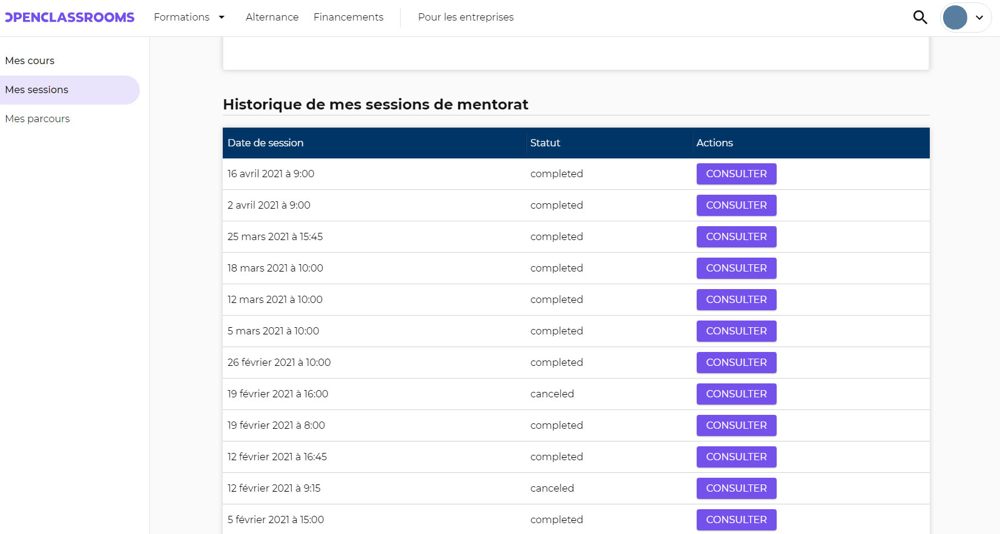
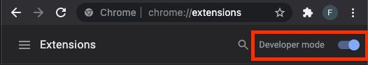
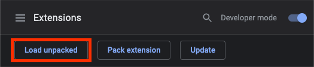

<!-- PROJECT LOGO -->
<br />
<p align="center">
  <a href="https://github.com/fabrahaingo/OCSessions">
    
  </a>

  <h3 align="center">OCSessions</h3>

  <p align="center">
    A Chrome extension that displays multiple mentorship session reports on <a href="https://openclassrooms.com">OpenClassrooms</a> website 👀 🥳.
    <br />
    <a href="https://github.com/fabrahaingo/OCSessions/issues">🐛 Report Bug</a>
    ·
    <a href="https://github.com/fabrahaingo/OCSessions/issues">Request Feature 🌟</a>
  </p>
</p>

<!-- TABLE OF CONTENTS -->
<details open="open">
  <summary>Table of Contents</summary>
  <ol>
    <li>
      <a href="#about-the-project">About The Project</a>
      <ul>
        <li><a href="#built-with">Built With</a></li>
      </ul>
    </li>
    <li>
      <a href="#getting-started">Getting Started</a>
      <ul>
        <li><a href="#prerequisites">Prerequisites</a></li>
        <li><a href="#installation">Installation</a></li>
      </ul>
    </li>
    <li><a href="#usage">Usage</a></li>
    <li><a href="#roadmap">Roadmap</a></li>
    <li><a href="#contributing">Contributing</a></li>
    <!-- <li><a href="#license">License</a></li> -->
    <li><a href="#contact">Contact</a></li>
    <!-- <li><a href="#acknowledgements">Acknowledgements</a></li> -->
  </ol>
</details>

<!-- ABOUT THE PROJECT -->

## About The Project



Quite recently, OpenClassrooms launched its API.<br>
This is great news for us developers: meaning that we can easily get features that don't exist, without waiting for the official release.

Here's why I created this extension:

- Many of my students were asking why they couldn't access their old mentorship reports via their dashboard. I concluded that `students were in need for such a feature`.
- Many times, I mentionned previous session reports, which sadly made latest reports unclear. Therefore, `reports were harder to write for mentors`.
- This feature `barely cost processing power` for OpenClassrooms' servers, and the advantages that it provides to both mentors and students is substantial.

Please note that as OpenClassrooms' API evolves, this extension might need to be updated / become useless. In that case, don't hesitate to [open an issue](https://github.com/fabrahaingo/OCSessions).

### Built With

This extension makes (almost entirely) use of OpenClassrooms' `preexisting style classes`.

[Javascript](https://developer.mozilla.org/fr/docs/Web/JavaScript) was used to build the entire extension.

<!-- GETTING STARTED -->

## Getting Started

### Prerequisites

You must have Chrome installed on your computer.
In case you don't have it, [click here to install it](https://www.google.com/intl/fr_fr/chrome/).

We will also be using the Terminal so make sure you have one installed. ([MacOS](https://support.apple.com/fr-fr/guide/terminal/apd5265185d-f365-44cb-8b09-71a064a42125/mac) / [Windows](https://www.microsoft.com/fr-fr/p/windows-terminal/9n0dx20hk701?activetab=pivot:overviewtab))

Lastly, we'll be cloning this repo with git. [Install it](https://git-scm.com/book/en/v2/Getting-Started-Installing-Git).

### Installation

1. Open your terminal and enter this command:
   ```sh
   cd ~/Desktop
   ```
2. Clone this repo with:
   ```sh
   git clone https://github.com/fabrahaingo/OCSessions
   ```
3. Open Chrome, and enter this URL:
   `chrome://extensions`
4. Switch on the `developer mode` toggle at the top right hand corner.
   
5. Click on `Load unpacked` at the top left hand corner.
   
6. Select the repository called `OCSession` on your Desktop.
7. Tadaaa 🎉, simply go to [https://openclassrooms.com/fr/dashboard/sessions](https://openclassrooms.com/fr/dashboard/sessions) and you should see a list of the last 20 sessions that you had / are going to have.

<!-- USAGE EXAMPLES -->

## Usage

The use of this extension is quite straightforward.
Anytime you want to consult an old session report, simply:

1. Navigate to [https://openclassrooms.com/fr/dashboard/sessions](https://openclassrooms.com/fr/dashboard/sessions)
2. Click on `Consulter`, next to the report you want to read.

<!-- ROADMAP -->

## Roadmap

See the [open issues](https://github.com/fabrahaingo/OCSessions) for a list of proposed features (and known issues).

<!-- CONTRIBUTING -->

## Contributing

Contributions are what make the open source community such an amazing place to learn, inspire, and create. Any contributions you make are **greatly appreciated**.

1. Fork the Project
2. Create your Feature Branch (`git checkout -b feature/AmazingFeature`)
3. Commit your Changes (`git commit -m 'Add some AmazingFeature'`)
4. Push to the Branch (`git push origin feature/AmazingFeature`)
5. Open a Pull Request

<!-- LICENSE -->

<!-- ## License

Distributed under the MIT License. See `LICENSE` for more information. -->

<!-- CONTACT -->

## Contact

Fabien Rahaingomanana - [LinkedIn](https://www.linkedin.com/in/fabien-rahaingomanana/) - hellofabien@pm.me

OCSessions: [https://github.com/fabrahaingo/OCSessions](https://github.com/fabrahaingo/OCSessions)

<!-- ACKNOWLEDGEMENTS -->

<!-- ## Acknowledgements

- [GitHub Emoji Cheat Sheet](https://www.webpagefx.com/tools/emoji-cheat-sheet)
- [Img Shields](https://shields.io)
- [Choose an Open Source License](https://choosealicense.com)
- [GitHub Pages](https://pages.github.com)
- [Animate.css](https://daneden.github.io/animate.css)
- [Loaders.css](https://connoratherton.com/loaders)
- [Slick Carousel](https://kenwheeler.github.io/slick)
- [Smooth Scroll](https://github.com/cferdinandi/smooth-scroll)
- [Sticky Kit](http://leafo.net/sticky-kit)
- [JVectorMap](http://jvectormap.com)
- [Font Awesome](https://fontawesome.com) -->

## Contributors

<a href="https://github.com/fabrahaingo/OCSessions/graphs/contributors">
  
</a>

Made with [contributors-img](https://contrib.rocks).
